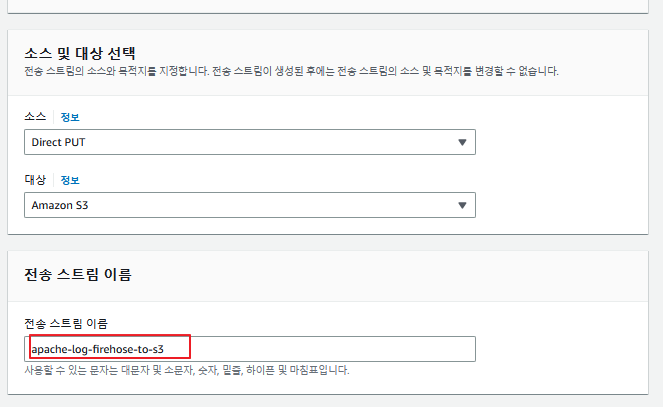
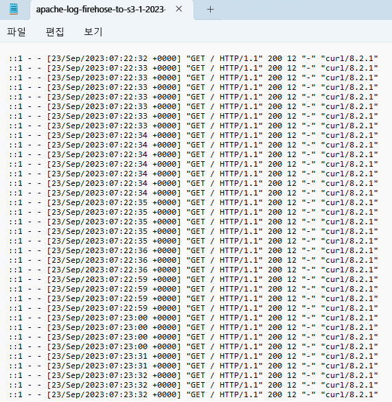
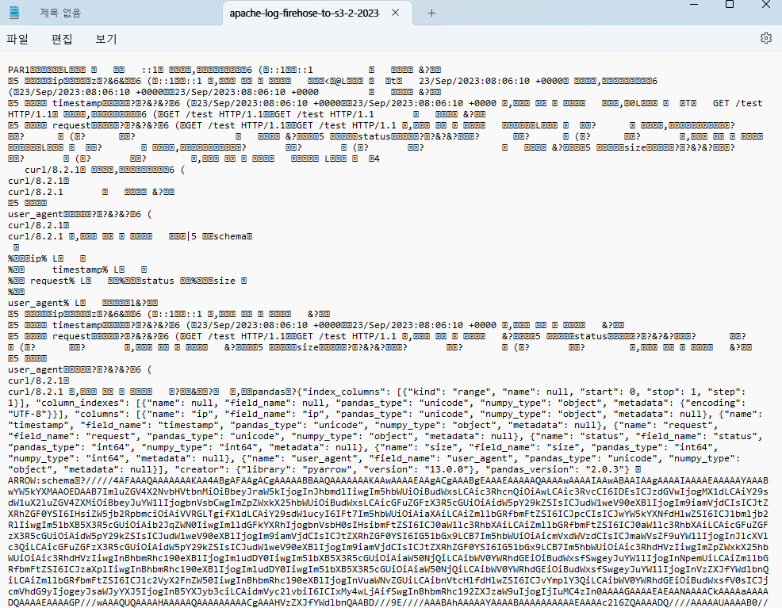

### Create Firehose Stream


### EC2 setting
```bash
#!/bin/bash
yum install -y httpd
sed -i 's/PasswordAuthentication no/PasswordAuthentication yes/g' /etc/ssh/sshd_config
echo 'password' | passwd --stdin ec2-user
echo 'Hello World page' >> /var/www/html/index.html
systemctl restart sshd
systemctl restart httpd
```

### install kinesis-agent
```bash
yum install -y aws-kinesis-agent
```
### edit /etc/aws-kinesis/agent.json
```json
# command 
# vim /etc/aws-kinesis/agent.json
{
  "cloudwatch.emitMetrics": true,
  "firehose.endpoint": "firehose.ap-northeast-2.amazonaws.com",
  "flows": [
    {
      "filePattern": "/var/log/httpd/access_log",
      "deliveryStream": "apache-log-firehose-to-s3"
    }
  ]
}
```

### Permission Settings
```
chmod 755 /var/log/httpd 
chmod 644 /var/log/httpd/access_log 
```

### kinesis agent service start
```
/etc/init.d/aws-kinesis-agent restart
chkconfig aws-kinesis-agent on
```

### result


### apache-to-parquet result
