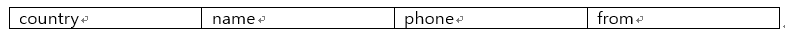

```
-	from 필드가 null일 경우 from의 value는 ec2로 설정합니다. 
-	모든 필드를 소문자로 변환합니다.
-   SQL 쿼리 수행시 다음 필드만 존재하게끔 설계합니다.
```



- code: lambda_function.py

### python keyword
- lower()
- json.loads()
- json.dumps()